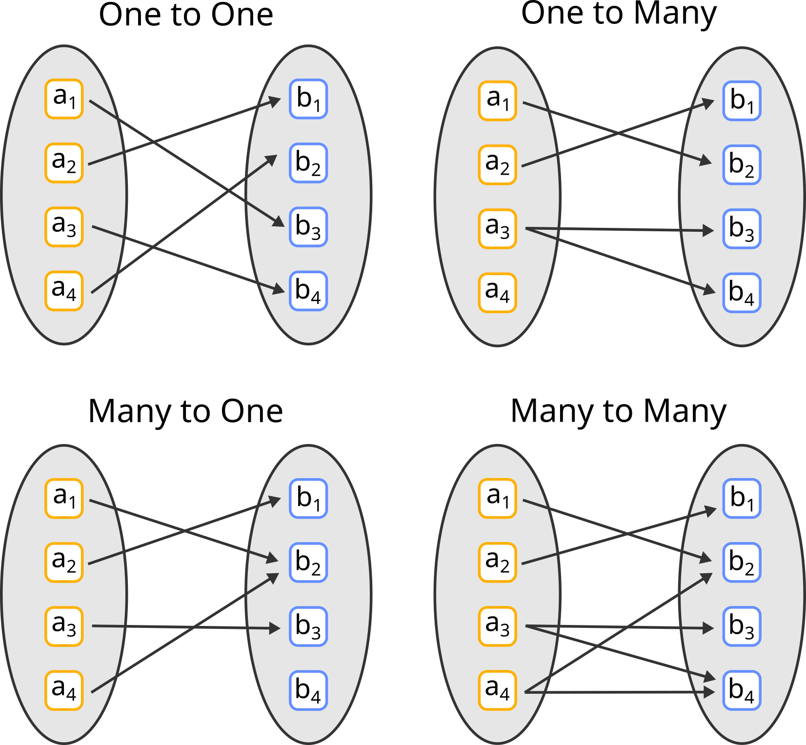

# ER model
* **Entity** Object that exist in a given domain, ex: A specific professor
* Entity set: Set of entities, ex: set of all professors
* Attributes: Properties of an entity set, ex: salary of a professor
* Primary key PK: With one or more attributes we can form a PK of the entity set, by knowing it we can uniquely identify the entity, ex: citizen id number.
* Composite attributes: Attributes with nested attributes, ex: address can be composed of street, city, state, postal_code
* Relationship: Association between 2 or more entities, ex: Professor John Doe linked to course Big Data with a relationship Teaches
* Relationship set: Mathematical relationship between the entities of 2 or more entity sets, ex: (John Doe, Big Data) belongs to the relationship set Teaches.
* Relationship attributes: Relationship sets can have attributes, ex: when a Professor started Teaching a Course.
* Cardinality constraints: We can classify the relationship in these ways:

Top left: Both A and B total partecipation, Top right: A partial, B total, Bottom left: A total, B partial,  Bottom right: A and B total partecipation.

* Derived attributes: Attributes whose value can be computed from othe attributes, ex: The number of courses that a professor is teaching.
* Weak entity set: An entity set whose existence is dependent on another entity set called identifying entity, ex: The entity set Dog is identified by the entity set Person.
* Specialization: Allows to handle common attributes between entity sets, ex: Car and Truck specialize Vehicle
  * Total: A higher level entity corresponds to 1 or more lower level entities, ex: Vehicle can be a Car or a Truck
  * Partial: Not all higher level entities can correspond to lower level entities, ex: Vehicle can be different from a Car or Truck
  * Disjoint: A higher level entity corresponds to exactly 1 lower level entities, ex: Vehicle can be either a Car or a Truck but not both
  * Overlapping: A higher level entity can correspond to more than 1 lower level entities, ex: A Person can be both a Degree holder and a Diploma holder.


# Relational model
Database is stored by means of tables, the columns tell the attributes of the data, while the rows are the records, ex: (John, Doe) is a row in the table Person, with columns Name and Surname

* Database schema: logical design of the database
* Database instance: Snapshot of the database and the data contained
* Primary key (PK): Identifies uniquely the row, usually chosen as the minimal set of attributes needed to identify the row.

Constraints:
* Not null: Forbids NULL values in a column
* Uniqueness: Can be defined over 1 or more columns, forbids duplicates values in these columns
* Primary key: Union of Not null and Uniqueness constraints over a column or a group of columns
* Foreign key: Indicates an attributes of relation A that must appear also in relation B, ex: Department(<ins>name</ins>, budget) Professor(<ins>name</ins>, <ins>surname</ins>, salary, dept_name), we define the foreign key FK {Professor.dept_name} -> {Department.name}

What to do when a referenced value is deleted:
* Delete cascade
* Put NULL instead
* Refuse deletion

# Entity to relational mapping
* Strong entity set: Turn it into a table
* Weak entity set: Turn it into a table and add a column for the primary key of the identifying strong entity set
* Composite attributes: Flatten them and store them individually
* Multivalued attributes: Create a new schema for each multivalued attribute, with two columns, one for the primary key of the strong entity set, and one for the multivalued attribute. The PK in this case is the union of both columns. Ex: Person(<ins>ID</ins>, name, age) has an attribute phone number that can take multiple values so we create a new table Person_phone(<ins>person.ID</ins>, <ins>phone number</ins>). We basically treat phone number as a weak entity set
* Many to many relationship: Add a new table with the keys of the partecipating entities + the attributes of the relationship set. To enforce total partecipation (1, n) we must use triggers, ex to enforce that an advisor has at least one student.
* (0, 1) - (0, n) Relationship: Add a the key of the table with many connections to the table with one connection. Ex: in case of only 0 or 1 advisor per student, add advisor ID to the Student table. 
* (1, 1) - (1, 1) Relationship: Simply put all in a single table. 

# SQL (Structured Query Language)

Provides Data Definition Language DDL, Data Manipulation Language DML and Administration tasks. The language is case insensitive.

## DDL

* `CREATE TABLE r(A1 D1, ..., AN DN, C1, ... , CM)` Creates table r with attributes A1, ... AN An and integrity constraints C1, ... , CM.  
  Ex:  
  ``` 
  CREATE TABLE Instructor(  
    ID          char(5),
    name        varchar(20) NOT NULL,
    dept_name   varchar(20),
    salary      numeric(8,2),
    PRIMARY KEY (ID),
    FOREIGN KEY (dept_name) REFERENCES Department(name)
  );
  ```
* `INSERT INTO Instructor VALUES ("10221", "Smith", "Biology", 66000);` Inserts a new tuple in the table Instructor
* `DELETE FROM Instructor;` Deletes all tuples in Instructor
* `DROP TABLE Instructor` Removes the table Instructor
* `ALTER TABLE Instructor ADD surname varchar(20);` Adds surname to the table instructor, all tuples are assigned NULL values to this attribute.
* `ALTER TABLE Instructor DROP name;` Removes the attribute name from the table Instructor

## SQL Query

* Basic query
  ```
  SELECT attribute(s)
  FROM relation
  WHERE condition
  ```
* SELECT DISTINCT: SQL queries allow duplicates, to remove them we use the keyword DISTINCT
* Select salary / 2 and rename it to half_salary
  ```
  SELECT ID, salary / 2 AS half_salary
  FROM Instructor
  ```
* Cartesian product of Instructor and Teaches
  ```
  SELECT *
  FROM Instructor, Teaches
  ```
* ORDER BY attribute ASC/DESC: Orders by attribute in ascending/descending order
  ```
  SELECT *
  FROM Instructor, Teaches
  ORDER BY Instructor.name ASC
  ```

* String operations:
  * %: Matches any substring
  * _: Matches any character
  * \: Escape character  
  Find all professor whose name starts with Fab
  ```
  SELECT *
  FROM Instructor
  WHERE name LIKE Fab%
  ```

* UNION, INTERSECT, EXCEPT: Set union, intersection, difference between two relations
  ```
  (SELECT name
  FROM Instructor
  WHERE salary > 20000)
  UNION
  (SELECT name
  FROM Instructor
  WHERE name LIKE %dar%)
  ```

* IS NULL: Checks for null values

* Aggregate functions: AVG, MIN, MAX, SUM, COUNT apart from COUNT they ignore all NULL values
  ```
  SELECT AVG(salary)
  FROM Instructor
  ```
  ```
  SELECT COUNT(DISTINCT name)
  FROM Instructor
  ```

* GROUP BY: Groups by an attribute, Ex: Find the average salary of instructors in each department
  ```
  SELECT dept_name, AVG(salary) AS avg_salary 
  FROM Instructor
  GROUP BY dept_name
  ```

* HAVING: Like WHERE but on groups, Ex: Find the average salary of instructors in each department HAVING salary > 40000
  ```
  SELECT dept_name, AVG(salary) AS avg_salary 
  FROM Instructor
  GROUP BY dept_name
  HAVING AVG(salary) > 40000
  ```
  HAVING is applied after the formation of groups, WHERE is applied before the formation of groups

### Nested subqueries
Find the number of students who have taken a course taught by instructor with ID 10101 

```
SELECT COUNT(DISTINCT student_id)
FROM Takes
WHERE course_id in (
        SELECT course_id
        FROM Teaches
        WHERE Teaches.ID = 10101
    )
```

* SOME: Select professors whose salary is greater than any instructor in the Biology department  
  ```
  SELECT ID, name
  FROM Instructor
  WHERE salary > SOME (
          SELECT salary
          FROM Instructor
          WHERE dept_name = "Biology"
      )
  ```

* ALL: Expression is True only if all its subexpressions are True

* EXISTS: Returns True if the argument subquery is non-empty

* UNIQUE: Returns True if the argument subquery contains no duplicates


## Indexes
Allow to find efficently specific values or a range of values 
Ordered indexes: Search keys are stored in sorted order
Cons:
* Access time: Sometimes it is still better to perform a linear scan
* Update time: Whenever I modify the database I must update the corresponding indexes as well
* Space overhead

### Primary index
Data is sorted according to the search key and stored sequentially

### Secondary index
Tells us where the data lies, gives us the pointers to the data. The data is not physically stored in the order of the index

## Transactions
A Transaction is a unit of the program execution that accesses or updates data items. Ex: Transfer 50€ from account A to B  
Issues: System failure mid-execution, concurrent execution of multiple transactions

A transaction takes the database in a consistent state and leaves the database in a consistent state (PK, FK, integrity constraints satisfied). During the transactions these constrainsts can be broken

We want to run transactions in parallel to speed-up their execution  


# Query processing
1. Parsing and translation: Check syntax and translate SQL into relational algebra
2. Optimization: Chooses the "most efficent" query execution plan (QEP)
3. Evaluation: Evaluates the query execution plan

## Optimization
The optimizer chooses the best QEP by checking all the equivalent relational algebra expressions x all the algoritms to evaluate and expression.  
Input: A query in relational algebra
Output: The "best" QEP

### Measure query cost
Response time is dependent on many factors, available RAM, availability of indexes, free buffer size, runtime parameters. Since response time depends on these factors we will focus on minimizing the resource consumption, which is machine-independent.  
### Assumptions
1. We ignore CPU utilization and RAM access time and only consider the time to seek a block from the main disk $t_s$ ans the time to transfer a block from and to the main disk $t_T$. With this we are assuming that the time to write a block is the same as reading it. 
2. We do not consider the time to write the output to the disk. This is because sometimes the output of an operation is immediatly used by a subsequent operation or kept in memory, rather than stored.
3. Files are organized according to **sequential file organization**. A file is stored in contiguous blocks with records ordered by some attribute. This allows to scan an entire table with a single seek.

$$\mathrm{QueryCost} = N_s t_s + N_T t_T$$  

### Glossary
* $b_r$ Number of blocks containing records in relation $r$
* $n_r$ Number of records in relation $r$
* $b$ Number of blocks containing matching records
* $h_i$ Height of the B+ tree 
* $n$ Number of matching records
* Comparison: >, <
* $M$ Blocks that fit into memory
## Single operations costs
### Selection
* **Linear search**: Perform a file scan on the relation and test the condition on all the records
  * Equality on non-key attribute: $t_s + b_r t_T$
  * Equality on key attribute: $t_s + b_r/2 \; t_T$
  * Comparison on key/non-key attribute: $t_s + b_r t_T$
* **Index Scan**: Use an index to only check part of the table
  * Primary index, equality condition on key (single record): $(h_i + 1)(t_s + t_T)$
  * Primary index, equality on nonkey (retrieve multiple records): $h_i(t_s + t_T) + t_s + t_T b$
  * Secondary index, equality on key: $(h_i + 1)(t_s + t_T)$
  * Secondary index, equality on nonkey: $(h_i + n)(t_s + t_T)$ // Question, why not $n (h_i + 1)(t_s + t_T)$
  * Primary index, comparison: $h_i(t_s + t_T) + t_s + b t_T$
  * Secondary index, comparison: $(h_i + n)(t_s + t_T)$

### Complex selections

* Conjunctive selection using 1 index, $\theta_1 \; \mathrm{AND} \; \theta_2 \; ... \; \mathrm{AND} \; \theta_n$. One index for each simple condition $\theta_i$. We can use the index on condition $\theta_j$ and check also the other conditions on the retreived tuples. Cost is given by the cost of the chosen algorithm for the chosen condition
* Conjunctive selection using composite index: $\sigma_{\mathrm{name=x AND dept=y}}$ We can use a composite index over the pair (name, dept). The cost will be the same as secondary index, equality on nonkey.
* A9 Conjunctive selection by intersection of identifiers: Retrieve all pointers that match condition $\theta_i$ in set i. Then intersect these sets and finally retrieve the records from the disks. Additional conditions which do not have an index can be checked in this phase. $\sum_i (h_i + n_i)(t_r+t_s) + (t_r+t_s)b$
* A10 Disjunctive selection by union of identifiers: If all conditions have indexes we do like in the previous case but perform set union on the pointers, not intersection. Even if only 1 condition has no index -> linear scan.

We can sort the pointers retrieived by the index before accessing the disk to reduce seek time.  
Another alternative is the bitmap: 1 bit per block in the relation, set the bit to 1 if we need to access that block. When accessing the disk traverse the bitmap and access only the blocks with a 1 and perform a linear search on these blocks. This avoids the sorting of pointers.

A4, A6, A9, A10 index scans can be worse than a linear scan if the number of records retrieived is high

## Sorting
If relation fits in memory -> Load it into memory and sort it
### External Sort-Merge
Good choice for relations that don't fit in memory
1. Read $M$ blocks of relation $r$ into memory
2. Sort them using merge sort
3. Write run to disk
4. Repeat 1-3 for all the block in $r$, creating runs $R_1, ..., R_n$
5. If $N < M$ merge the runs:
   1. Load the first block of each run into memory
   2. Find the lowest record in the loaded runs
   3. Write it into a buffer
   4. If the memory buffer is full write the block to disk
   5. If a run block is empty load the subsequent block from the disk
   6. Repeat 1-5 until all the runs have been processed
6. If $N >= M$ proceed like in point 5 but with subsets of runs that fit in memory, creating a new set of runs $R_1^1, ..., R_n^1$. This lowers the number of runs by a factor of $M-1$
7. Repeat 5-6 until 5 gets executed.

$$Cost \approx 2b_r \log_{M-1}(b_r)(t_s + t_T)$$

If we allow loading k blocks the run-reduction factor will be $M-1 / k$ but we reduce the number of seeks

$$Seeks = b_r / M + 2b_r / k \; \log_{M/k - 1}(b_r/M) - b_r / k$$
$$Transfers = 2b_r \log_{M/k - 1}(b_r) - b_r$$

Higher transfers but lower seeks, obviously the formulas need ceilings around float numbers.

## Join
### Nested loop join
```python
for tr in r:
  for ts in s:
    if condition(ts, tr):
      add_to_result(ts, tr)
```

$Transfers = n_rb_s + b_r$ Need to read $s$ $n_r$ times and also read $r$ one time  
$Seeks = n_r + b_r$

### Block nested loop join
```python
for bi in br:
  for bj in bs:
    for tr in bi:
      for ts in bj:
        if condition(ts, tr):
          add_to_result(ts, tr)
```

$Transfers = b_rb_s + b_r$  
$Seeks = 2b_r$

Better than nested loop join, if there is more space in memory I can read more blocks of the outer relation, or even store the inner relation entirely in memory. Another improvement could be to use forward and backward scans of the inner relation, this allows to re-use the last block, which is already in the buffer.

### Indexed nested loop join
If an index is available on one of the attributes of a join condition we could use it as an inner relation.  

```python
for bi in br:
  for tr in bi:
    Index scan on tuples in s whcih satisfy the condition
```
For each tuple in $r$ we do an index scan on $s$

$$Cost = b_r (t_T + t_s) + n_r \mathrm{IndexScanCost}(s, t_r, \theta)$$

If we have indexes for both relations it is often better to use the one with less records as outer relation.


## Cost of an expression tree

We can combine the results above to evaluate the cost of an entire expression tree.  
* Materialization: Can always be applied, we store the intermediate results on the disk and use them later, disadvantage: several disk writes.
* Pipelining: Process multiple steps at the same time by passing the result of expressions to subsequent ones, avoid unecessary disk writes, disadvantage: not always possible, ex: output of External Sort-Merge, input of indexed loop join.

## Choosing the best QEP
1. Generate equivalent expressions using equivalence rules
2. Annotate in all possible ways all these expressions
3. Evaluate the cost of each QEP
4. Choose the best based on estimated cost

We estimate the cost based on statistical information on the relations (number of tuples, number of distinct values, ...) and cost formula of algorithms

## Generating equivalent expressions
Two relational algebra expressions are **equivalent** if the two expressions generate the same result on every legal database instance
An equivalence rule states that the expressions of two forms are equivalent.

**Equivalence rules**:
* $\sigma_{\theta_1 \wedge \theta_2} = \sigma_{\theta_1}(\sigma_{\theta_2})$
* Selections can be combined with cartesian products and theta joins
* Theta joins are commutative
* Natural joins are associative
* Theta joins are associative but with some constraints

Optimizers use a **minimal** set of equivalence rules, i.e. no rule can be derived from others.

1. Start from a relational algebra expression and apply all equivalence rules, generating subsequent expressions
2. Store the new generated expressions
3. Repeat 1-2 until no new expressions are found

This approach is expensive both in time and memory.  
We can reduce space requirements by only storing changed parts of expressions and use pointers.  
We can improve the time by using:
* Dynamic programming
* Greedy search
* Heuristics 

## Cost estimation
We know the cost formulas of each operation, but we need to know their parameters, ex: number of tuples > v for index scan. The database stores these statistics in the **catalog**.

However we also need to compute the cost of intermediate expressions -> need to estimate the statistics of intermediate results, we will focus on two things:
1. Estimation of size of intermediate results, i.e. number of tuples
2. Estimation of number of distinct values in intermediate results, selectivity rate

The problem becomes harder when we also consider that the statistics are not accurate, the catalog may not be up to date.

When no histogram is available we assume uniform distribution of values

### Glossary
* $V(A, r)$ Number of distinct values that appear in $r$ for the set of attributes $A$
* $s$ Size of selection
* $SR(\sigma_{\theta}(r) = s/n_r$ Selectivity rate of selection


### Selection size
* $\sigma_{A=v}(r)$, no histogram: $n_r / V(A, r)$, 1 if $A$ is key
* $\sigma_{A\leq v}(r)$, no histogram: $0$ if $v < min(A, r)$, $n_r$ if $v > max(A, r)$, otherwise $n_r \frac{v-min(A,r)}{max(A, r) - min(A, r)}$. Without statistics or $v$ is not known we assume $n_r / 2$. With histograms we can do better.
* Complex(nested) selection: $SR(\sigma_i) = s_i/n_r$ then $\mathrm{s_E} = n_r SR(E) = n_r (s_1 \cdot s_2 \cdot ... \cdot s_n) / n_r^n$
* Disjunction: Turn into conjunction and apply above

### Join size
* Cartesian product: $n_r n_s$
* Natural join on A: $n_r n_s/V(A, s)$ or $n_s n_r/V(A, r)$, the lowest is the more accurate estimation $n_r n_s/\max(V(A, s), V(A, r))$. A more accuate estimation can be done with an histogram
  * If $A$ is key for $r$ then $\# records \leq n_s$
  * If $A$ in $s$ is a not null FK then $\# records = n_s$
* Theta join $n_r n_s SR(\theta)$

## Choosing the evaluation plan
We must also consider the interaction between the algorithms, ex block join may be slower than index join but can be pipelined

Query optimizers search all the QEP and choose the best in term of cost using heuristics, a optimizer needs:
* A space efficent representation of expressions
* Efficent detection of duplicate expressions
* Dynamic programming
* Heuristics to avoid generating all plans (perform selections and projections early, perform most restrictive selections and joins before other ones, consider only left-deep joins)

# Distributed DBMS
Data physically distributed but logically centralized
**Distrubuted computing** A number of autonomous processing elements that are interconnected by a computer network and cooperate in performing their assigned tasks.

distr. DB systems : distr. processing = DM systems : centr. processing

A **distributed database** (DDB) is a collection of multiple, logically interrelated databases physically distributed over a computer network.  
A **distributed DBMS** (D-DBMS) is the software that manages the DDB and provides access mechanisms that make the distribution transparent to the users.

* Delivery modes
  * Pull only
  * Push only
  * Hybrid
* Frequency
  * Periodic
  * Conditional
  * Ad-hoc or irregular
* Communication methods
  * Unicast
  * One-to-many

We focus on pull-only, ad-hoc, unicast communication

Distributed DBMS promises:
* Transparent management of distributed, fragmented and replicated data. The DB is distributed but the user sees a centralized DB.
* Improved reliablity and availability, no single point of failure
* Improved performance due to data localization and parallelism
* Easier system expansion, as easy as adding a new node to the network

Distributed DBMS complications:
* Failure tolerance of nodes or links
* Syncronization of transactions
* Replication

**CAP Theorem**, a DDB can't provide simultaneously:
* Consistency, we always read updated data
* Availability, every request receives a response
* Partition tolerance, tolerance to netwoek communication failures

DMS classification:
* Distribution: non-distributed vs client-server vs fully distributed.
* Heterogeneity: homogeneous vs heteregeneous
  * Data model, query language, transaction management
* Autonomy: Degree to witch a single DBMS can operate indipendently, tight integration vs semiautonomous vs total isolaton.

Ex:
* DDBMS is fully distributed, homogeneous, tightly integrated.
* Multi database systems are fully distributed, heteregeneous, totally isolated.
* Centralized DBMS is non-distributed, homogeneous, tightly integrated.

## Distributed DB design

We need to decide where data and programs reside across the sites of a computer network

### Reasons for fragmentation
* Distributed FS are not fragmented (unit is teh file)
* Fragmenting entire relations isn't good because applications commonly access a subset of a relation, i.e. $r$ is stored in Paris but application x accesses part of its contents from New York, leading to high communication costs -> we need to fragment the relation itself.
* **Locality** allows for finer accesses
* **Intra-query parallelism**

### Drawbacks of fragmentation
* Can cause queries to be executed on more than one fragment -> performance degradation
* Harder and costlier integrity constraints enforcement

### Types of fragmentation
* Horizontal fragmentation: Fragment the tuples  
  * Primary Horizontal Fragmentation (PHF): Introduced by a set of minterms $M$, the minterms are given by the most common queries over the database, $R_i = \sigma_{m_i}(R)$. Ex: query $\sigma_{budget < 200000} (PROJ)$ induces the set of minterms $M = \{budget < 200000, !(budget < 200000)\}$, which in turn induces the fragmentation $F = \{PROJ_1, PROJ_2\}$
  * Derived Horizontal Fragmentation (DHF): TODO 
* Vertical fragmentation: Fragment the attributes, harder than HF because a more than exponential number of partition of a set exist, we can track the columns accessed by each query, based on this information and the number of query execution we can compute an affinity measure between the columns, based on this measure we can then fragment the columns. Partitioning the affinity matrix is hard, possible techniques are:
  * Mathematical optimization, formulate the problem as MIP
  * Machine learning
  
* Hybrid fragmentation: Fragment both, to reconstruct it apply reconstruction operators from the leaves to the root of the fragmentation tree

We need to choose the degree of fragmentation, from tuples/attributes to relations

### Fragmentation Requirements
* Completeness: The decomposition of $R$ into $R_1, ..., R_n$ is complete if and only if each data item in $R$ can also be found in some $R_i$
* Reconstruction: There should exist a relational operator $\nabla$ such that $R = \nabla(R_1, ..., R_n)$ 
* Disjointness: If $R$ is decomposed into $R_1, ..., R_n$ and data item $d_i$ is in $R_j$ then $d_i$ should not be present in any other fragment $R_K$ with $k \neq j$

### Allocation Requirements
* Partitioned: Each fragment at one site
* Fully replicated: Each fragment at all sites
* Partially replicated: Each fragment at some sites

If $\mathrm{\frac{ReadOnlyQueries}{UpdateQueries}} >> 1$ then replication is advantageous, otherwise it may cause problems.

### Information Requirements
A lot of factors affect the coices toward an optimal design:
* Logical organization of the DB
* Location of DBMS applications
* How applications access the DB
* Computer hardware
* Communication networks

### Set of simple predicates
A set of simple predicates must be:
* Complete: All queries are taken into account, we have that every application Q accesses either all or none of the tuples of a fragment F
* Minimal: All predicates should be relevant in the set, each predicate produces fragments not produced by other predicate and these produced fragments are accessed differently by at least one application

The PHF algorithm can be used to produce a minimal complete set of simple predicates given a relation $r$ and a set of simple predicates $Pr$ over  the attributes of $r$.


## Distributed query processing
Must also take into account data transfer among sites in the QEP.

### Data localization
Input: A relational algebra expression on global, distributed relations (distributed query)
Output: A relational algebra expression on fragments

Localization uses global information about distribution of fragments, no catalog statistics are used.

**Localization program** Relational algebra expression that reconstructs a global relation from its fragments

**Localized query** Obtained from a distributed query by replacing global relations with their corresponding localization programs.  
This provides parallelism: $(A_1 \cup A_2)\bowtie(B_1 \cup B_2) = A_1 \bowtie B_1 \cup A_1 \bowtie B_2 \cup A_2 \bowtie B_1 \cup A_2 \bowtie B_2$  
And eliminates unnecessary work, ex if $A_1 \bowtie B_1 = \empty$ we can skip its computation.

### Operations on PHF
* Selection: Ignore a fragment if selection predicate and fragment predicate are contradictory.
* Join: Ignore join of two fragments if their predicates are contradictory over the join attributes

### Operations on VF
* Reduction: Ignore the reduction on fragments where their attributes do not intersect the projection attributes 


